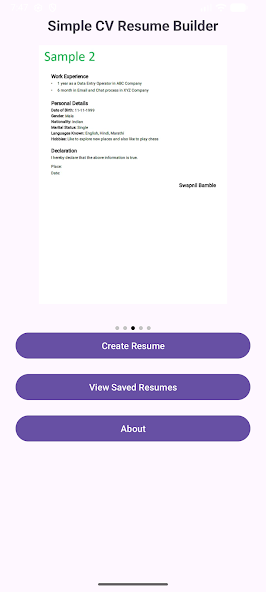
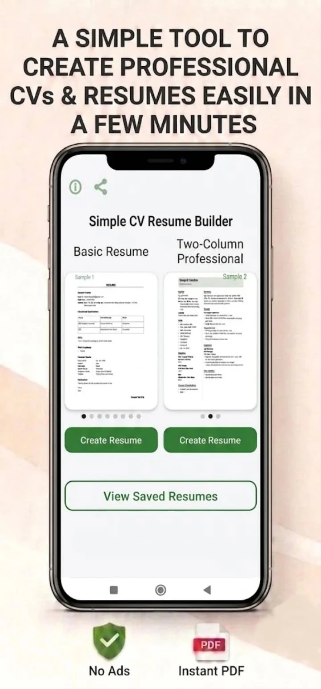
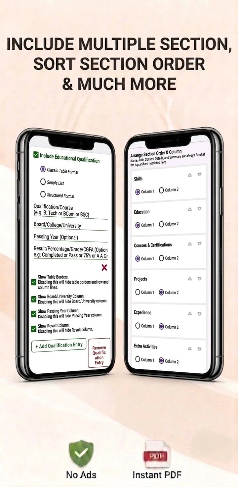
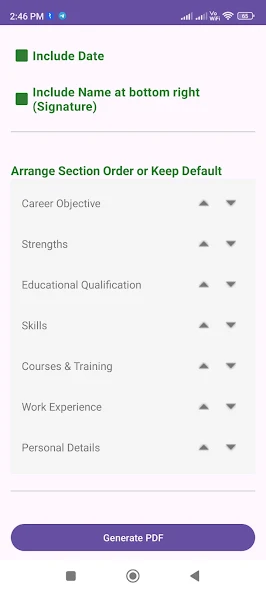
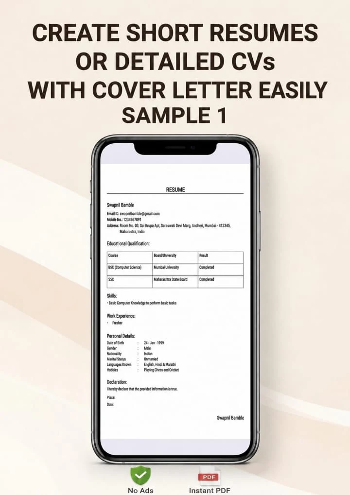
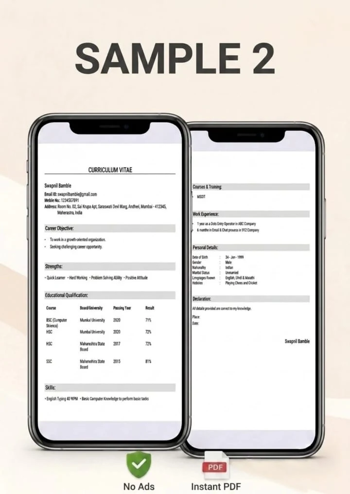
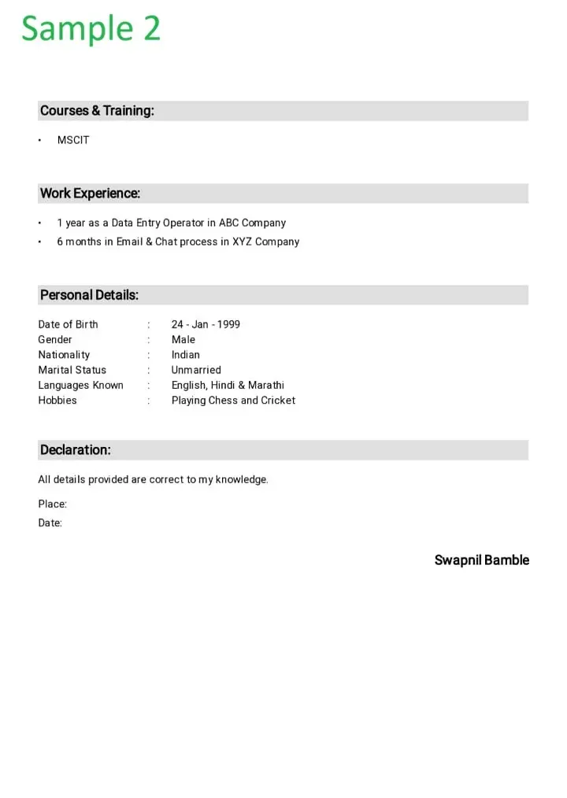
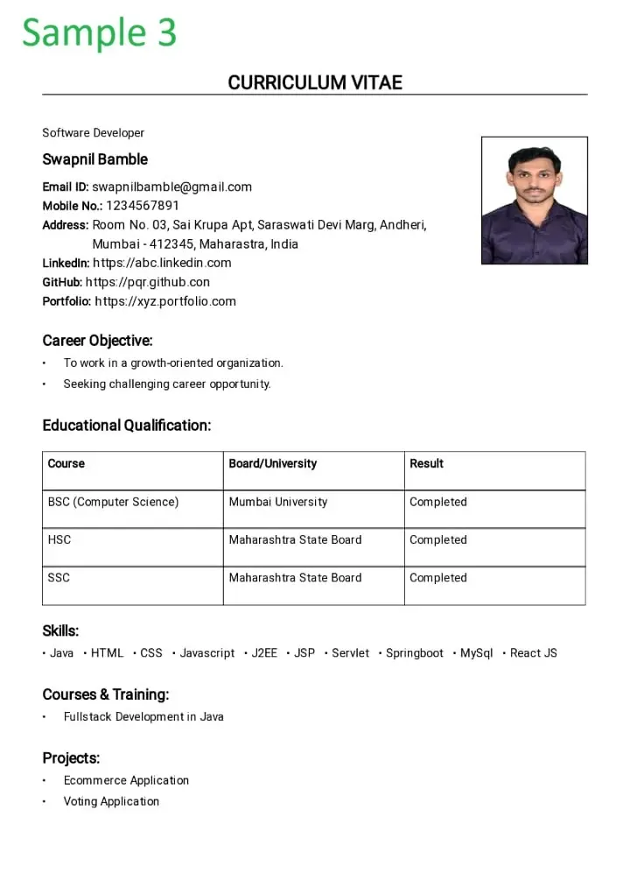
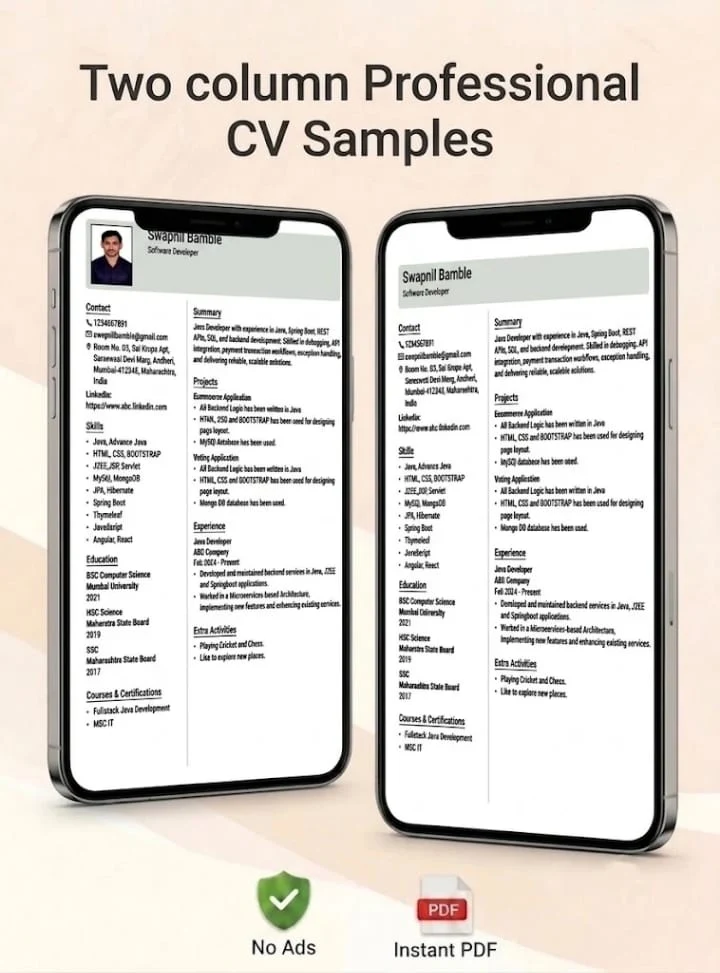

##  Simple CV Resume Builder
👇👇👇

   

👆👆👆

          OR

🔍 Search on Play Store:
### Simple CV Resume Builder

Resume builder & CV maker app to create professional resumes easily and ad-free. Build job-ready resumes in minutes using this simple resume creator and CV builder. Perfect resume maker for freshers and professionals.

Create your perfect resume with Simple CV Resume Builder, a fast and easy resume builder designed to help you generate clean and professional resumes in minutes.

Whether you are a fresher, student, or experienced professional, this powerful CV maker and resume creator makes resume building simple and effective.

✨ Key Features:

Easy and fast resume builder

Simple form-based CV maker

Create a job-ready professional resume

Works as resume creator and CV creator

Clean and minimal resume design

No technical or design skills required to create resume

🎯 Perfect For:

Freshers and students

Job seekers and professionals

Anyone looking for a quick resume maker free

Users needing a simple and effective resume writer

🚀 Why Choose This App:

Lightweight and fast CV builder

Clean UI for better experience

All-in-one resume builder & CV maker

No subscription, pay once and use forever

Create your professional resume today and stand out in your job applications with ease.

### See some screenshots of this app:

  
  
  
  
  
  
  
  
  

### Created By
### Swapnil Bamble

